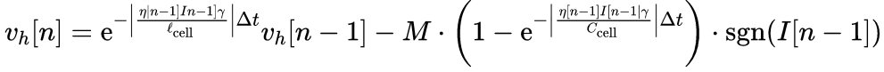
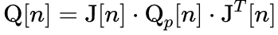

# Potential Improvements
This document will detail the potential improvements that can me made to the model by discussing some of the issues that arose

## Problem 1: Hysterisis
Currently the model assumes that the charge and discharge profile is the same and thus we ignore hysterisis.
This is obviously not accurate and thus we need to be able to model it. This can be done easily by charging 
and discharging the battery (See Problem 3)

Including hysteresis into the model can be done by expanding the states to contain the hysterisis voltage, `vh`. 
This is given by the equation

where `η` is the coloumbic efficiency, `M` is the max hysteresis polarisation voltage and  `γ` is the hysteresis rate

The output equation will then contain `vh` in it as well
## Problem 2: Q matrix 
Currently, the Process Noise matrix, Q has been estimated based off literature which leads to some inaccuracies.
This matrix should ideally be calculated based on the standard deviations of all the parameters used in the state equations.

These parameters include: `[R0, R1, R2, C1, C2, Cap]`. Once we have the standard deviations of these parameters, we can find out the
process noise matrix by using the following equation:

where `Qp` is a diagonal matrix containing the standard deviations squared and `J` is the Jacobian of the system

The exact matrix for `J` is given in `Potential_Improvements.py`

## Problem 3: Relationship between OCV and SOC
Currently the OCV-SOC curve used is based on the discharge curve given by the manafacturer which is prone to inaccuracies.
Furthermore, we dont have the Charging curve (only the discharging one) so that also adds to the inaccuracy

This can be fixed by determining this relationship experimentally. The accumulator needs to be charged up to full and then discharged in small steps.
Afterwards, its should be allowed to rest and then one can measure the voltage to get the values for the OCV. This should continue until the accumulator
is drained to get the Discharge curve. The process should be reversed to get the Charge curve

This also gives us values for `η` and `M`

## Problem 4: Create more Lookup Tables

To get the best possible model, all the aforementioned parameters should be implemented as Lookup Tables under different temperature
, aging and SOC conditions. This means that in every interation, the parameters' values can be changed to best match the recorded conditions

One way to get these lookup tables is to run a specific current profile under the different conditions and fit the KF function so that the output voltages
match the actual recorded voltage. More information on particular experiments that can be run are listed in https://www.mdpi.com/1996-1073/14/13/3733
