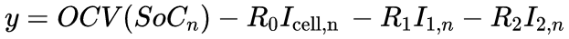

#Model Explanation
This model uses a Kalman Filter to try and predict what the SOC of the car will be after n iterations. Most of the 
implementation is based on: https://www.mdpi.com/1996-1073/14/13/3733

##Cell model
An equivalent circuit model was used that is summarised here:

This represents what each cell looks like

##State definitions

The state and output equations are as follow:

x_n+1 = A* x_n + B* u_n+1 + Q

y = C * x_n + D * u_n+1 + R

The states, x, used were: [SOC,I1,I2]

The input, u was [I_cell]

The output, y is the voltage across the cell, v

The matrices A and B were calculated based on the following equations:

The matrix C was calculated based on:

The following steps were then carried out:

1. First the matrices for the states and the state error are initialised in the matrices `xhat` and `Phat`
2. Then the states are predicted using the state equation. The results are stored in `xp`
3. Next, the state error and output are predicted and stored in `Pp` and `y` respectively
4. The Kalman gain, K, is calculated to allow the predictions to be corrected
5. `xp` and `Pp` are corrected and the resulting values are stored in `xc` and `Pc`
6. `xc` and `Pc` are used in the next iteration for Step 3.

The full equations for the steps are:

.png)

For information on the specific values chosen, refer to the `main.py` or `BatteryParams.py` file

#Usage 
Choose a simulation profile from `Extras/Simulation_profiles.py` to use in `main.py`. In `main.py`, define this function as the variable
`v_measured` and then run the code.

`v_measured` will be the voltage data we get for the cell with the lowest voltage but this step is necessary for the simulation. We will 
also use the current that we measure from the car but for simulation purposes, this is calculated based on the circuit model above

The output will be 3 graphs showing how the voltage changes per iteration, both the actual and calculated one, as well as the error between the measured 
and calculated values and the SOC that was calculated 

#Improvements
1. The model currently assumes that the discharge and charge profile is the same thus ignoring hysterisis
2. The Process noise matrix, Q should be calculated based on the standard deviations of the parameters used in the state equations.
However, since we dont have these values, the value of Q is based off estimations.
   
3. The relationship between the OCV and the SOC (used in the output equation) is assumed to be the same as the nominal dicharge relationship
In reality, this needs to be determined experimentally
   
These improvements need to be implemented by doing tests on the accumulator which are detailed here: https://www.mdpi.com/1996-1073/14/13/3733
The exact tests needed are in Section 4.1 and 4.2 of the document
